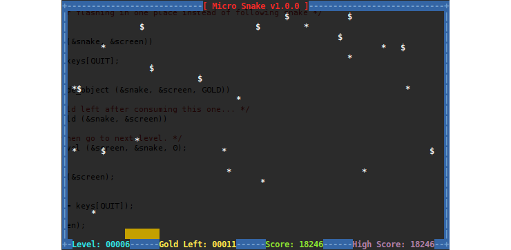

Micro Snake
===========

The theme started with [Micro Tetris] continues with this version of the
snake (worm) game.  It is very small and only utilizes ANSI escape
sequences to draw the board.  Hence, very suitable for embedded devices.

Introduction
------------

From [Wikipedia](http://en.wikipedia.org/wiki/Snake_%28video_game%29):

> Snake is a video game released during the mid 1970s and has maintained
> popularity since then, becoming somewhat of a classic.  The first
> known microcomputer version of Snake, titled 'Worm', was programmed in
> 1978 by P. Trefonas (USA) on the TRS-80 computer, and published by
> CLOAD magazine the same year.  This was followed shortly afterwards
> with versions from the same author for the PET and Apple II computers.
> A microcomputer port of Hustle was first written by P. Trefonas in
> 1979 and published by CLOAD magazine [2].  This was later released by
> Milton Bradley for the TI-99/4A in 1980.

Playing the game
----------------

The aim of the game is to collect the gold ($), avoid cactuses (*) and
borders, including colliding with the tail of the snake itself. As you
collect gold, the snake gets longer, thus increasing the likelihood of
crashing into yourself.  When all gold has been collected you are hauled
to the next level without any warning.  For each new level the snake
gets longer and the amount of gold and cactuses increases.

You get scored according to the length of the snake and the number of
cactuses on the screen.  The speed increases every 5 levels.  You get a
bonus of 1000 points when you complete each level.

**Note:** There is no concept of lives.  Once you hit an obstacle,
that's it, game over.

To move the snake:

    a - Up,
    z - Down,
    o - Left
    p - Right
    
    f - Left turn
    j - Right turn
    
    q - Quit the game at any time.

There is a define in `snake.h` you can change if you want to alter these
settings.  Make sure you do not have caps lock on, otherwise the keys
will fail to respond.

Origin & References
-------------------

Micro Snake is based on an original implementation by [Simon Huggins].
Current maintainer is [Joachim Nilsson].

The orignal version of the source code is available as the first commit
of the official Git repository.  Note that Simon's original use library
functions that are not available on all systems -- it was designed using
Borland C++ Builder / Turbo C.  Most of this has been refactored during
the porting effort to GNU/Linux.  There has also been some game design
changes to improve the overall feeling.

[Micro Tetris]:    http://github.com/troglobit/tetris
[Repository]:      http://github.com/troglobit/snake
[Issue Tracker]:   http://github.com/troglobit/snake/issues
[Simon Huggins]:   http://github.com/huggyfee
[Joachim Nilsson]: http://troglobit.com
[tarball]:         http://troglobit.com/snake/snake-1.0.1.tar.bz2
[hashfile]:        http://troglobit.com/snake/snake-1.0.1.tar.bz2.md5

